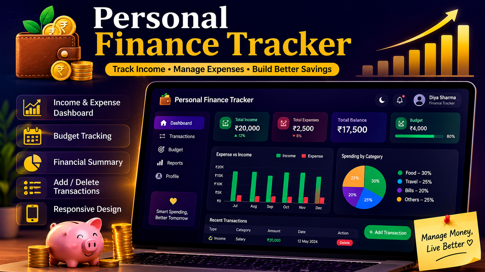

# 💰 Personal Finance Tracker

## 📌 About The Project

Personal Finance Tracker is a simple and user-friendly web application that helps users manage their income, expenses, budget, and savings.

## ✨ Features

- 💰 Add Income
- 💸 Add Expenses
- 📊 Track Budget
- 🧾 Manage Transactions
- 📈 View Financial Summary
- 💾 Data stored using Local Storage
- 📱 Responsive Design

## 🛠️ Technologies Used

- HTML
- CSS
- JavaScript
- Local Storage

## 🌐 Live Demo

[View Live Website](https://diyasharma20061.github.io/Personal-Finance-Tracker/)

## 👩‍💻 Author

**Diya Sharma**
